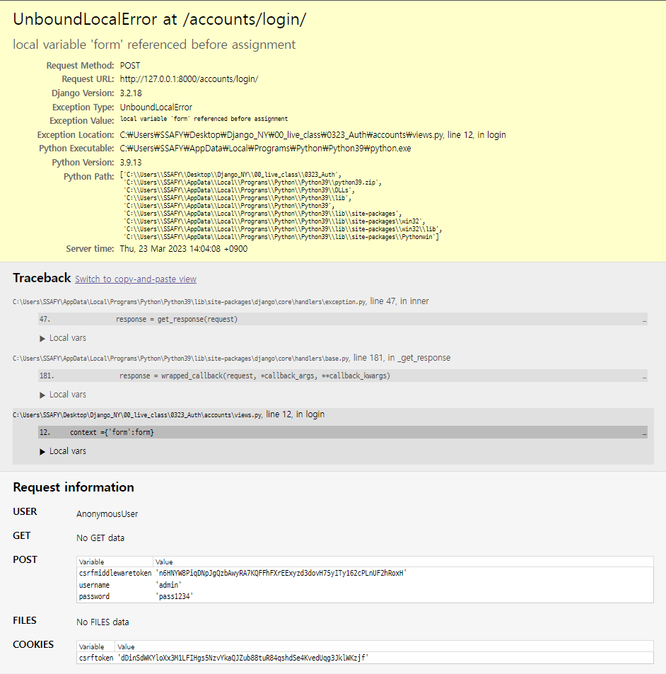

# Login/Logout

## Login

- 세션을 Create하는 과정

- 장고의 built-in form 사용
  
  
  
  - built-in form이 있으므로 forms.py에 form을 정의할 필요없이 views.py에서 바로 사용가능

- views.py에서 POST 메서드일때 처리할 내용
  
  - 로그인 폼에 입력한 내용을 가져와서 form 변수에 저장 : request.POST 뿐만아니라 request를 첫번째 인자로 넣어주어야함.
  
  - 이 폼에 대한 유효성검사 -> 장고의 login 빌트인 함수 활용하기 : 헷갈리니까 as로 이름 바꿀 것
  
  - 저장하고 어떤 페이지 보여주기

- html파일에서 form action = url :해당 url 로 데이터를 보낸다.

- 입력되는 정보를 받을 페이지,. 안적으면 현재 페이지로 감. 근데 현재 페이지에서 작업하니까 결과는 똑같음. 그냥 명시성 을 위해서 적는거임.

---

## 로그아웃?

클라이언트, 서버의 DB에 있는 세션을 Delete하는 과정

1. urls -> views -> templates

`
